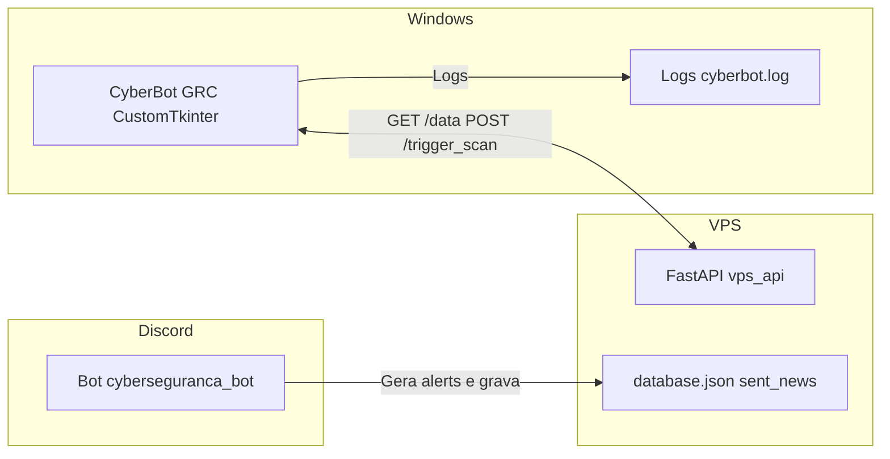

<div align="center">

# 🛡️ CyberBot GRC – Painel de Controle & SOC

[](https://www.python.org/)
[](https://fastapi.tiangolo.com/)
[](#)
[](#)
[](#)

Dashboard Windows para monitorar ameaças de cibersegurança em tempo real, integrado ao bot do Discord e à sua VPS.

</div>

---

## 📌 Visão Geral

O **CyberBot GRC** é um ecossistema de monitoramento de segurança composto por:

- 🤖 **Bot do Discord** – coleta alertas de fontes externas, gera Embeds e grava o `database.json` na VPS.
- 🌐 **API FastAPI (VPS)** – expõe os dados de segurança via HTTP e recebe comandos de varredura (`/trigger_scan`).
- 💻 **App Desktop Windows (CustomTkinter)** – painel gráfico que:
  - Exibe os alertas em cards no estilo **Embed do Discord**;
  - Usa cores por severidade (CRITICAL / HIGH / MEDIUM / INFO);
  - Possui botões de ação (Leia Mais, WhatsApp, E-mail, NOW, Encerrar);
  - Mantém **logs estruturados** em arquivos rotativos.

Todo o fluxo foi pensado para **GRC (Governança, Risco e Conformidade)**, com foco em:

- Disponibilidade ✅
- Integridade dos dados ✅
- Confidencialidade (via VPS) ✅
- Auditabilidade (logs detalhados) ✅

---

## 🏗️ Arquitetura

O diagrama abaixo usa [Mermaid](https://docs.github.com/en/get-started/writing-on-github/working-with-advanced-formatting/creating-diagrams) e é renderizado pelo próprio GitHub na visualização do README.



### Fluxos principais

1. **Coleta de inteligência**
   - O bot do Discord consome feeds, calcula CVSS, gera Embeds e salva tudo em `data/database.json` na VPS.
2. **Monitoramento no Windows**
   - O app desktop consome `GET /data` periodicamente (30 em 30 minutos) e exibe os cards no painel.
3. **Varredura manual (NOW)**
   - Botão **🚀 Executar NOW (Scanner)** chama `POST /trigger_scan` na VPS.
   - A VPS registra o pedido (e futuramente aciona o bot para rodar `/now`).
   - Após sucesso, o painel atualiza o feed imediatamente.
4. **Encerramento controlado**
   - Botão **⛔ Encerrar Sistema** abre um diálogo de confirmação (Sim/Não) e encerra todas as threads (UI + tray).

---

## 📂 Estrutura de Pastas (resumida)

```text
cyber_seguranca-installer/
├── main.py               # Entrada do app desktop (Windows)
├── vps_api.py            # API FastAPI na VPS (porta 8000)
├── requirements.txt      # Dependências do projeto
├── assets/
│   ├── icon.ico          # Ícone do app / executável
│   └── icon.png          # Ícone em PNG (fallback)
├── core/
│   ├── bridge.py         # Ponte HTTP: consumo da API, NOW, compartilhamento
│   ├── logger.py         # Módulo de logging centralizado
│   └── exceptions.py     # Exceções específicas do domínio
└── ui/
    └── dashboard.py      # Interface gráfica (CustomTkinter)
```

---

## 🧩 Componentes Principais

### 1. `vps_api.py` – API de Dados e Comandos

- **Endpoints:**
  - `GET /data`
    - Lê `data/database.json` (gerado pelo bot do Discord);
    - Retorna o JSON completo (incluindo `sent_news[]`);
    - Trata erros de:
      - Arquivo inexistente;
      - JSON corrompido;
      - Permissão de leitura;
      - Erros inesperados (todos logados).
  - `POST /trigger_scan`
    - Ponto único para disparar a varredura manual **NOW**;
    - Atualmente registra o pedido em log e retorna:
      - `{ "status": "accepted", "detail": "..." }`;
    - A integração com o bot do Discord pode ser plugada aqui (chamada da função `/now`).
- **Middleware de logs**:
  - Loga toda requisição (`method`, `path`, `client_ip`, `status`).
- **Eventos de ciclo de vida**:
  - `startup` / `shutdown` logam a subida e parada da API.

### 2. `core/bridge.py` – Ponte Windows ↔ VPS

- **Constantes:**
  - `VPS_IP`, `URL_DADOS`, `URL_TRIGGER_SCAN`, `DASHBOARD_URL`.
- **Funções:**
  - `fetch_data()` – consome `GET /data`.
    - Trata:
      - Status HTTP ≠ 200;
      - JSON inválido;
      - Campo `sent_news` não ser lista;
      - Timeouts e erros de conexão;
    - Em caso de erro, retorna um card de fallback:
      - `{"title": "...", "description": "...", "link": "#", "timestamp": ""}`.
  - `parse_severity(title)` – extrai `CVSS x.y` do título e define:
    - `CRITICAL` – preto;
    - `HIGH` – vermelho;
    - `MEDIUM` – amarelo;
    - `INFO` – verde.
  - `open_url(url)` – abre URLs no navegador padrão com logs e tratamento de erro.
  - `share_whatsapp(title, link)` – monta um `wa.me` com texto pré-preenchido e abre no navegador.
  - `share_email(title, description, link)` – monta um `mailto:` com assunto e corpo preparados.
  - `trigger_scan_now()` – chama `POST /trigger_scan` na VPS e retorna `True/False`.

### 3. `ui/dashboard.py` – Painel SOC no Windows

- Baseado em **CustomTkinter**:
  - Sidebar com comandos SOC;
  - Área principal com feed de vulnerabilidades;
  - Janela auxiliar para análise de URL (VirusTotal / URLScan);
  - Toasts (popups) de status.

#### Sidebar – Comandos SOC

Cada botão é estilizado com cor e ícone:

| Botão                        | Cor            | Ação                                                                 |
|-----------------------------|----------------|----------------------------------------------------------------------|
| 🔄 **Sincronizar News**     | Azul           | Força a leitura imediata de `GET /data` e recarrega o feed          |
| 📊 **Dashboard Web**        | Azul escuro    | Abre o dashboard Node-RED na VPS (`DASHBOARD_URL`)                  |
| 🧬 **Buscar CVE (NVD)**     | Verde/teal     | Abre a página da CVE digitada no campo (`https://nvd.nist.gov/...`) |
| 🕵️ **Analisar URL (SOC)**  | Laranja        | Abre janela para analisar URL em URLScan + VirusTotal               |
| 🚀 **Executar NOW (Scanner)** | Roxo          | Chama `trigger_scan_now()` → `POST /trigger_scan` → `load_feed()`   |
| ⛔ **Encerrar Sistema**     | Vermelho       | Abre diálogo de confirmação e encerra o app por completo            |

#### Cards no estilo Discord Embed

Cada item de `sent_news[]` é exibido por `create_discord_style_card`:

- Borda colorida pela severidade (`sev_color`).
- Header:
  - Ícone do projeto (a partir de `assets/icon.ico` ou `.png`);
  - Nome do bot: `cyberseguranca_bot`;
  - Badge **APP** (azul Discord);
  - Badge de severidade (CRITICAL/HIGH/MEDIUM/INFO).
- Corpo:
  - Título clicável (abre a fonte/NVD);
  - Descrição da vulnerabilidade (texto truncado, estilo embed).
- Rodapé:
  - Timestamp humanizado (ex: `Hoje às 13:01` se esse formato vier do JSON).
- Barra de ações:
  - 📖 **Leia Mais** – abre o link no navegador;
  - 🟢 **WhatsApp** – abre WhatsApp Web com mensagem pronta;
  - 📩 **E-mail** – abre cliente de e-mail com assunto/corpo preparados.

#### Feedback visual e encerramento

- `show_status(message, variant)` – exibe um **toast**:
  - `variant="success"` – verde;
  - `variant="error"` – vermelho;
  - `variant="info"` – cinza escuro.
  - Usado, por exemplo, após o botão NOW.
- `confirm_quit()`:
  - Abre diálogo `CTkToplevel` com:
    - ✅ **Sim, encerrar**
    - ↩️ **Não, voltar**
  - Em caso de **Sim**:
    - Fecha diálogo, chama `self.quit()` e depois `os._exit(0)` para matar todas as threads (inclusive tray).

### 4. `main.py` – Entrada do App Desktop

- Cria a instância `CyberBotApp`, que:
  - Carrega o `Dashboard`;
  - Configura o ícone de janela (taskbar) via `icon.ico`;
  - Configura o ícone de bandeja (system tray) com **PyStray**:
    - Menu:
      - **Abrir Dashboard**
      - **Sair do SOC** (encerra app e threads).
- Também trata a chamada via protocolo customizado (ex.: `cyberbot://alert/...`):
  - Se `sys.argv[1]` existir, loga `"Aplicação chamada via protocolo customizado: ..."`.

### 5. `core/logger.py` – Logging Centralizado

- Cria logs:
  - Console colorido (com ícones, cores por nível);
  - Arquivo principal: `logs/cyberbot.log` (DEBUG+);
  - Arquivo de erros: `logs/cyberbot_errors.log` (ERROR+).
- Usa `RotatingFileHandler` para rotação automática.
- Função `log_exception(logger, exc, context)` adiciona stack trace completo e contexto.

---

## 🛠️ Como Rodar (Dev)

### 1. Clonar o repositório

```bash
git clone https://github.com/seu-usuario/projeto-cyberseguranca-bot.git
cd projeto-cyberseguranca-bot/cyber_seguranca-installer
```

### 2. Criar e ativar o ambiente virtual (Windows – PowerShell)

```powershell
python -m venv .venv
.venv\Scripts\Activate.ps1
pip install -r requirements.txt
```

### 3. Subir Bot + API na VPS (Linux)

**São necessários dois processos:**

1. **Bot** (porta 8080): `python main.py`
2. **API** (porta 8000): `uvicorn vps_api:app --host 0.0.0.0 --port 8000`

```bash
# Terminal 1 - Bot
cd projeto-cyberseguranca-bot-python
python main.py

# Terminal 2 - API (mesmo diretório)
cd projeto-cyberseguranca-bot-python
uvicorn vps_api:app --host 0.0.0.0 --port 8000
```

> O arquivo `vps_api.py` está no projeto do bot. Use `pip install fastapi uvicorn httpx` se necessário.

### 4. Rodar o Dashboard no Windows

```powershell
cd cyber_seguranca-installer
.venv\Scripts\Activate.ps1  # se ainda não estiver ativo
python main.py
```

---

## 🧪 Testes manuais rápidos

- Com a API ligada e `database.json` válido:
  - Abra o app (`python main.py`);
  - Verifique se:
    - O ícone aparece na barra de título e na bandeja;
    - O feed é carregado sem erros;
    - Botões de ação abrem as URLs corretas.
- Clique em:
  - **🚀 Executar NOW (Scanner)**:
    - Veja no log que o `POST /trigger_scan` foi chamado;
    - Confirme o toast verde de sucesso.
  - **⛔ Encerrar Sistema**:
    - Confirme o diálogo de confirmação;
    - Ao clicar em **Sim**, o app deve fechar por completo.

📋 **[Guia completo de testes e validação](tests/TESTES_VALIDACAO.md)** – Checklist para avaliadores, testes de NOW, System Tray, instalador e classificação de severidade.

---

## 📥 Download e instalação (instalador pronto)

Quem quiser **apenas instalar** o painel, sem buildar do código-fonte, pode usar o instalador publicado no repositório:

- **Pasta `dist_installer/`** – contém o **executável (.exe)** pronto para download e instalação no Windows.
- Basta baixar o arquivo da pasta `dist_installer/`, executar e seguir o assistente de instalação.
- Após a instalação, configure o IP da VPS em **Configurações** (ou edite o arquivo de configuração do app, se disponível) e tenha o bot e a API rodando na VPS para o feed funcionar.

> Se o repositório for clonado via Git, a pasta `dist_installer/` pode estar no histórico ou nas [Releases](../../releases) do projeto. Verifique também a seção **Releases** no GitHub para versões empacotadas.

---

## 📦 Gerando o Executável (.exe) com PyInstaller

Para **gerar o instalador a partir do código** (desenvolvedores), com o ambiente virtual ativo no Windows:

```powershell
cd cyber_seguranca-installer
pyinstaller main.py --onefile --noconsole --name "CyberBot-GRC" --icon "assets/icon.ico" --add-data "assets;assets"
```

- O executável será gerado em **`dist/CyberBot-GRC.exe`**.
- Para disponibilizar para outros usuários, copie o `.exe` para a pasta **`dist_installer/`** e faça commit (ou publique nas Releases do GitHub).
- Distribua junto com as instruções de configuração da VPS e do bot do Discord.

---

## 🔌 (Opcional) Protocolo Customizado `cyberbot://`

Para abrir o app a partir de links no Discord, você pode registrar um protocolo customizado no Windows:

1. Crie um arquivo `cyberbot.reg`:

```reg
Windows Registry Editor Version 5.00

[HKEY_CLASSES_ROOT\cyberbot]
@="URL:CyberBot Protocol"
"URL Protocol"=""

[HKEY_CLASSES_ROOT\cyberbot\shell]
[HKEY_CLASSES_ROOT\cyberbot\shell\open]
[HKEY_CLASSES_ROOT\cyberbot\shell\open\command]
@="\"C:\\Caminho\\para\\CyberBot-GRC.exe\" \"%1\""
```

2. Dê duplo clique no `.reg` para importar.
3. No Discord, use links como:
   - `cyberbot://alert/CVE-2025-1234`

O app será aberto e o parâmetro estará em `sys.argv[1]`, já logado no início da execução.

---

## 🤝 Contribuição

1. Abra uma issue com a melhoria ou bug encontrado.
2. Faça um fork do repositório.
3. Crie uma branch descritiva:

```bash
git checkout -b feature/melhoria-logs
```

4. Envie um Pull Request com:
   - Descrição clara da mudança;
   - Prints do dashboard (quando for mudança visual);
   - Referência às issues relacionadas.

---

## 📄 Licença

Este projeto está sob a licença **MIT**. Sinta-se livre para usar, adaptar e evoluir o CyberBot GRC em outros contextos de SOC, estudo ou produção.

